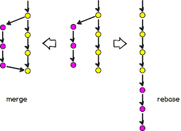

# Git Öğreniyorum

## SSH Key
Uzak git repolarına ulaşabilmek için şifre yerine key kullanmak önemli bir güvenlik yöntemidir.
```bash
# Aşağıdaki komut ile bir ssh key oluşturabiliriz. Bu key'i git providerımıza eklememiz gerekir.
ssh-keygen
# Aşağıdaki komut ile oluşturduğumuz keyin içeriğini görebiliriz.
cat ~/.ssh/id_rsa.pub
```

## README.md dosyası
Bu dosya ilgili projeye ait açıklamaları, notları vb. yazdığınız dosyadır. Markdown dosya formatına sahiptir.

## git config

Git'i ilk kurduğunuzda bu komut ile commit gönderecek kullanıcıyı ayarlayabilirsiniz.

```bash
git config --global user.name "Your name" 
git config --global user.email "Your email"

```

## git version
Hangi git versiyonunu kullandığınızı gösterir.

```bash
git version
```

## git init
Yeni bir git projesi başlatmak için kullanılır.

```bash
git init
# veya
git init <repo adı>
```

## git clone
Bir repoyu clonlamak için kullanılır.

```bash
git clone <repo adı>
# veya
git clone <repo adı> --recurse-submodules
```

## git add
Değişikliğe uğramış dosyaları stage'e ekler. Yani commit edilecek dosyalara ekler.

```bash
git add test.html
# veya
git add .
```

## git commit
Yapılan değişiklikleri local repoya eklemeye yarar. Push metodu ile bu değişiklikler remote repoya gönderilir.
```bash
git commit -m "feature: add masterpass"
# commit mesajlarında emir kiplerinin kullanılması çok faydalıdır. Yani eklendi, değiştirdi, silindi vb.
# Eğer pushlanmamış commitimizin mesajında değişklik yapmak istiyorsak bu komut kullanılır.
git commit --amend -m "add logo"

```
<i>Örnek commit mesajları için popüler react kütüphanesi incelenebilir.</i>
[https://github.com/facebook/react/commits/main](https://github.com/facebook/react/commits/main)

## git status
Anlık yapılan değişiklikleri gösterir.

```bash
git status
```
Örnek çıktı:
```bash
On branch main
Your branch is up to date with 'origin/main'.

Changes not staged for commit:
  (use "git add <file>..." to update what will be committed)
  (use "git restore <file>..." to discard changes in working directory)
        modified:   README.md

no changes added to commit (use "git add" and/or "git commit -a")
```

## git branch
Branchleri görüntülemeye ve değiştirmeye yarar.
```bash
# bütün branchleri listeler
git branch
# yeni bir branch oluşturur
git branch <branch adı>
# localdeki branchi siler
git branch -d <branch adı>
# remote branchi siler
git push -d origin <branch adı>
```

## git checkout
Branchler arasında geçiş yapmaya yarar.
```bash
# branch değiştirir
git checkout <branch adı>
# varolan branchin bir kopyasını oluşturur ve yeni branche geçiş yapar.
git checkout -b <branch adı>
# bir dosyadaki değişikliği geri alır. git reset ile aynı işleve sahiptir.
git checkout -- test.html

```

## git remote
Local repo ile remote repoları birbirine bağlar.
```bash
# react reposu ile local repoyu birbirine bağladı
git remote add react https://github.com/facebook/react

# bu bağlanan repoya değişikliklerimizi gönderelim
git push react main
```

## git push
Local değişiklikleri remote repoya gönderir.
```bash
git push origin develop
# Eğer her seferinde origin veya branch belirtmek istemiyorsak upstream set edebiliriz. sadece git push yazmamız yeterli olur.
git push -u origin develop
```

## git fetch
Remote değişiklikleri "local repoya" çeker. 
```bash
git fetch
```

## git pull
Remote içeriği "proje içine" çeker ve içeriği günceller.
```bash
git pull
# veya
git pull origin develop
```

## git stash
Projenizde yaptığınız değişiklikleri geçici olarak bir klasöre yedekler. Daha sonra bu klasörden bu değişiklikleri alabilirsiniz.
```bash
# değişiklikleri yedekler
git stash
# bütün yedekleme işlemlerini listeler
git stash list
# yedeklenmiş dosyaları projeye alır
git stash apply stash@{0}
# yedeklenmiş dosyaları projeye alır ve yedekleme işlemini kalıcı olarak siler.
git stash pop stash@{0}
```

## git log
Commit geçmişini gösterir.
```bash
# Varsayılan olarak o anki branchdeki commit geçmişini gösterir.
git log
# Bütün proje geçmişini görmeye yarar.
git log --all
# Commit geçmişini sade bir biçimde gösterir.
git log --oneline
```

## git show
Commitdeki değişiklikleri detaylı görmemizi sağlar.
```bash
git show <commit hash>
```

## git rm
Herhangi bir dosyayı siler ve remote repoda silmek için commit oluşturur.
```bash
git rm test.html
```

## git restore
Herhangi bir dosyayı siler ve remote repoda silmek için commit oluşturur.
```bash
git rm test.html
```

## git merge
Başka bir branchteki değişiklikleri varolan branch'e ekler.
```bash
git merge IP-1234
```

## git rebase
Merge ile benzer işlemi yapar ama önemli bir fark var. Commitler arasında yatay dallanma yapmaz. Dikey olarak commit geçmişini birleştirir.
```bash
git rebase IP-1234
```

          

## git revert
Herhangi bir commite geri dönmeye yarar ve bu değişiklik için yeni bir commit oluşturur.
```bash
git revert <commit hash>

# Eğer commit history tamamen silip istenilen commite dönüşmek isteniyorsa revert yerine reset kullanılabilir. Sakıncalı bir yöntemdir. Değişiklikleriniz kaybolur.
git reset --hard <commit hash>
git push --force
```

## git cherry-pick 
Herhangi bir branchteki commiti üstünde çalıştığınız branche almaya yarar.
```bash
git cherry-pick <commit hash>
# Eğer commit oluşmasın sadece dosyadaki değişiklikler alınsın istiyorsak.
git cherry-pick <commit hash> -n
```

## git archive 
Bir veya daha fazla dosyayı sıkıştırıp zip dosyası oluşturur.
```bash
git archive --format zip HEAD > archive-HEAD.zip
```

## git blame
Herhangi bir dosya üzerinde yapılan değişiklikleri gösterir. Git history değildir!. File history'dir.
```bash
git blame <dosya>
```

## git tag
Proje versiyonlamaya yarar. Git tag ile versiyon yarattığınızda o versiyondaki kodları artık değiştiremezsiniz. Tabi --force metodu vardır değiştirmek için ama önerilmez. Yeni bir versiyon çıkmanız daha doğru olur.
```bash
git tag v1.0.0
```

## git diff
Dosyadaki değişklikleri karşılaştırır.
```bash
git diff README.md
# İki farklı branchi karşılaştırmak için
git diff develop master
```

## git mv
Herhangi bir dosya veya klasörün adını değiştirir.
```bash
git mv eski.html yeni.html
```

## git submodule
Bir repo içine başka bir repoyu gömebiliriz.
```bash
git submodule add https://github.com/facebook/react
```

## git alias
Kısayollar tanımlamak için kullanılır.
```
git config --global alias.ch checkout
# Artık aşağıdaki gibi checkout komutunu kullanarabiliriz.
git ch
```

## .gitignore main branchte değişiklik yaptım
Bu dosya ile git'e gönderilmeyecek dosya veya klasörleri belirleyebiliriz.
Örnek: [https://github.com/facebook/react/blob/main/.gitignore](https://github.com/facebook/react/blob/main/.gitignore)
